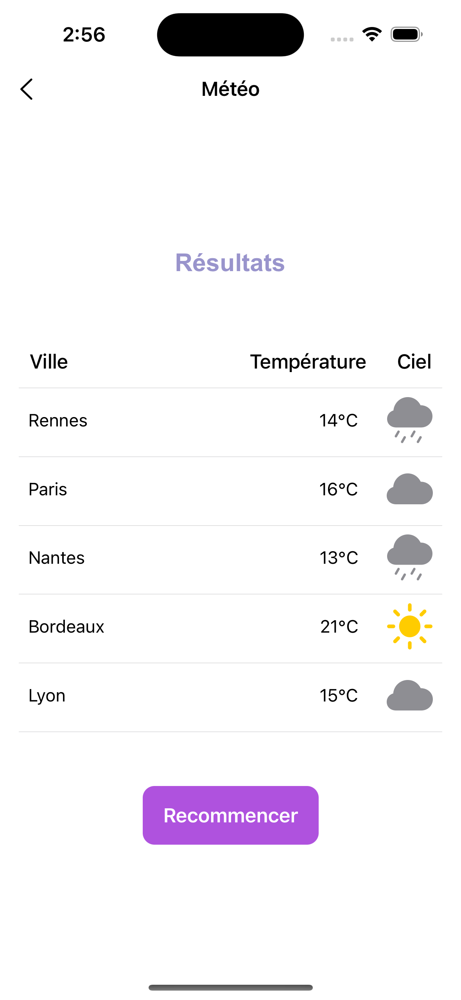

# EXOMIND

## Installation

* Installer cocoapods sur sa machine

* Lancer la commande pod install

* ouvrir le fichier EXOMIND.xcworkspace

* Lancer le projet

## Capture écrans

### Écran d'accueil

### Écran de début de remplissage de la jauge

### Écran de remplissage de la jauge en cours

### Écran de résultats

